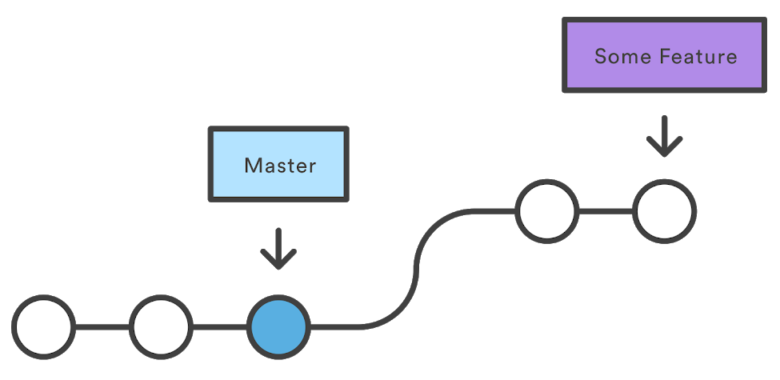

# Introduzione a Git
Laboratorio di Ingegneria del Software 2 - Anno accademico 2020-2021 - Università degli studi di Trento

Materiale utile:
- Git CLI (https://git-scm.com/downloads)
- GitHub (https://github.com), con l'indirizzo @unitn si ottiene la licenza pro
- Guida a git (https://devdev.it/guida-git-versioning/)

## Basics

1. Initialize a new repository in a local directory

    `git init`  

1. Configure git

    `git config --global user.name "<your name>"`
    
    `git config --global user.email <your email>`
    
    `git config credential.username <your username>`

1. Check status

    `git status`

    

1. Stage files (tracked and untracked)

    `git add .`
    
1. Commit staged changes

    (-m: add message)  
    (-a: stage changed tracked files, but in case you have new files you need to do `git add .` to manually track them )    
    (In Vim press `Esc` and then type `:q` to quit; `:w` to save; `:x` to save and exit)

    `git commit -m "first commit"`

1. Include staged changes in last commit

    `git commit -amend`

1. Check differences

    `git diff master^^ index.js` (check with 3 REPO commits ago)
    `git diff <hash> index.js `

1. Check commits history

    `git log --oneline`

    

1. Revert back your working directory to a previous commit

    `git checkout <commit ID>`

    `git checkout master`

## Branching

1. Modify files then create a new branch, stage and commit changes, and push to remote repository

    `git branch newFunction`  
    `git checkout newFunction`  
    `git commit -am "commit in the new branch"`   
    `git log`

    

1. Delete a branch

    `git branch -d newFunction`

1. Fast-forward merge

    `git checkout master`
    `git merge newFunction`
    `git log --graph --decorate --oneline`

    

1. Resolving conflicts in 3-way merge 

    `git mergetool`

    

## Collaboration

1. On github.com create a github repository

1. Clone repository in a local directory

    `git clone [repoAddress] [folderName]`

1. Check differences with remote repository
    
    `git diff origin master index.js `

1. Delete remote branch

    `git branch -d [branch_name]` (delete local branch)

    `git push origin -d [branch_name]`

    `git push origin :[branch_name]`

1. Git remote

    `git remote -v`

    `git remote add <name> <url>`

1. Pull changes

    `git pull`

    

1. Fetching changes without merging

    `git fetch origin master`

    `git branch -a`

1. Push changes to remote repository

    `git push origin master`

## Advanced

1. Stashing changes before applying

    `git stash`

1. Rebasing

    `git rebase -i master`

1. Tagging

    `git tag`

1. Reset
    - --soft – The staged snapshot and working directory are not altered in any way.
    - --mixed – The staged snapshot is updated to match the specified commit, but the working directory is not affected. This is the default option.
    - --hard – The staged snapshot and the working directory are both updated to match the specified commit.

    `git reset HEAD <file>...`

    `git reset HEAD~2`

1. Revert

    `git revert`

    

1. Check with gitk

    `gitk`

