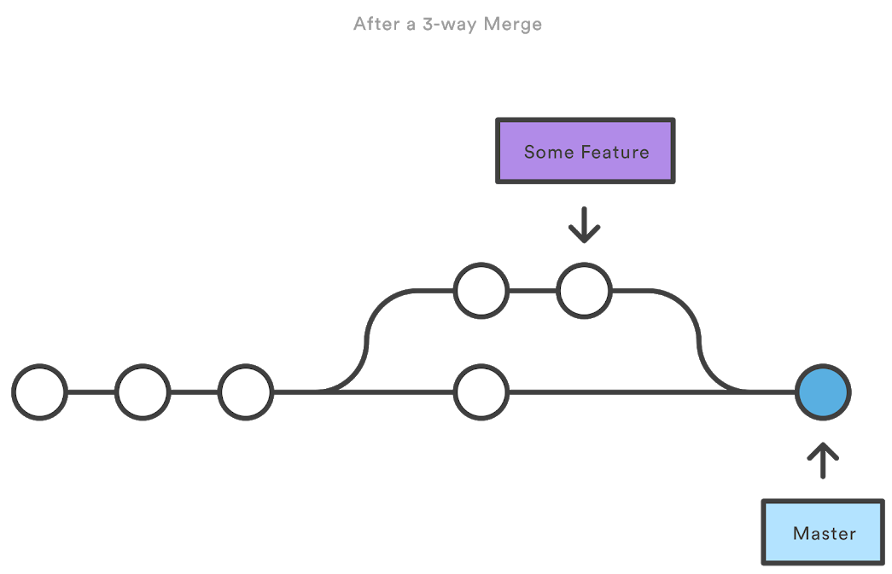
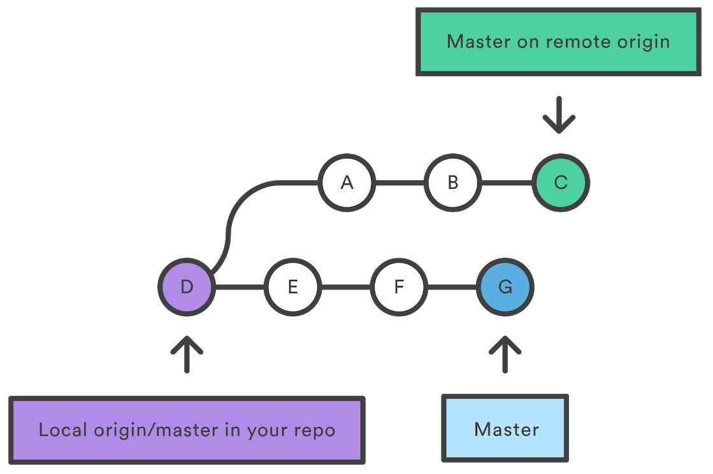
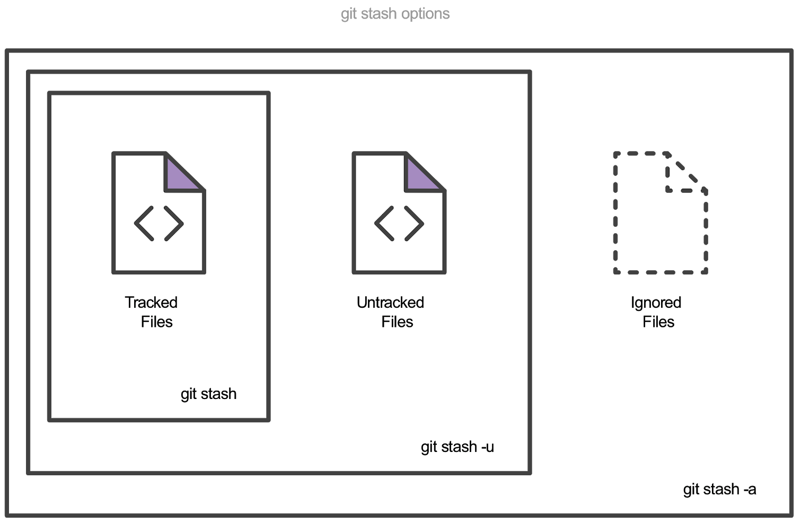
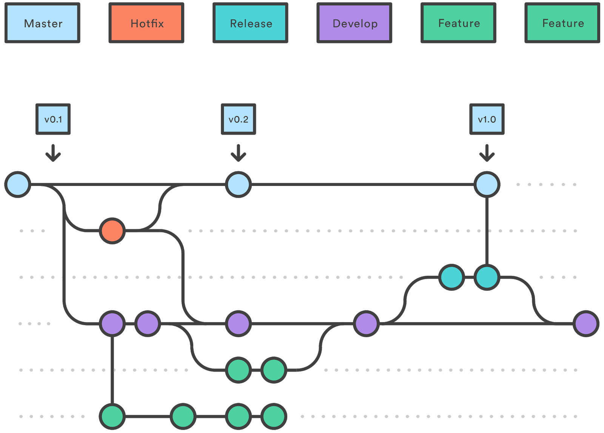

# Introduzione a Git
Laboratorio di Ingegneria del Software 2 - Anno accademico 2020-2021 - Università degli studi di Trento

Materiale utile:
- Git CLI (https://git-scm.com/downloads)
- GitHub (https://github.com), con l'indirizzo @unitn si ottiene la licenza pro
- Guida a git (https://www.atlassian.com/git/tutorials)

## Basics

https://www.atlassian.com/git/tutorials/setting-up-a-repository

1. Initialize a new repository in a local directory

    `git init`  

1. Configure git

    `git config --global user.name "<your name>"`
    
    `git config --global user.email <your email>`
    
    `git config credential.username <your username>`

1. Check status

    `git status`

    

1. Stage files (tracked and untracked)

    `git add .`
    
1. Commit staged changes

    (-m: add message)  
    (-a: stage changed tracked files, but in case you have new files you need to do `git add .` to manually track them )    
    (In Vim press `Esc` and then type `:q` to quit; `:w` to save; `:x` to save and exit)

    `git commit -m "first commit"`

1. Include staged changes in last commit

    `git commit -amend`

1. Check differences

    `git diff master^^ index.js` (check with 3 REPO commits ago)

    `git diff <hash> index.js `

1. Check commits history

    `git log --oneline`

    

1. Revert back your working directory to a previous commit

    `git checkout <commit ID>`

    `git checkout master`

## Branching

1. Modify files then create a new branch, stage and commit changes, and push to remote repository

    `git branch newFunction`
    
    `git checkout newFunction`

    Alternatively:

    `git checkout -b newFunction`

    `git commit -am "commit in the new branch"`

    `git log`

    

1. Delete a branch

    `git branch -d newFunction`

1. Fast-forward merge

    `git checkout master`
    
    `git merge newFunction`

    `git log --graph --decorate --oneline`

    

1. Resolving conflicts in 3-way merge 

    `git mergetool`

    

## Collaboration

https://www.atlassian.com/git/tutorials/syncing

1. On github.com create a github repository

1. Clone repository in a local directory

    `git clone [repoAddress] [folderName]`

1. Check differences with remote repository
    
    `git diff origin master index.js `

1. Delete remote branch

    `git branch -d [branch_name]` (delete local branch)

    `git push origin -d [branch_name]`

    `git push origin :[branch_name]`

1. Git remote

    `git remote -v`

    `git remote add <name> <url>`

1. Pull changes

    `git pull`

    

1. Fetching changes without merging

    `git fetch origin master`

    `git branch -a`

1. Push changes to remote repository

    `git push origin master`

## Advanced

1. Stashing changes before applying

    `git stash`

    `git stash pop`

    

1. Rebasing

    `git rebase master`
    (commits in current branch are "re-applied" to the head of master)

    `git rebase -i master`

    

1. Tagging

    `git tag v1.0`

    `git tag -a v1.0 -m "my version 1.0"`
    
    `git tag`

1. Reset
    - --soft – The staged snapshot and working directory are not altered in any way.
    - --mixed – The staged snapshot is updated to match the specified commit, but the working directory is not affected. This is the default option.
    - --hard – The staged snapshot and the working directory are both updated to match the specified commit.

    `git reset HEAD <file>...`

    `git reset HEAD~2`

1. Revert

    `git revert`

    

1. Check with gitk

    `gitk`

## Git Workflows

### Centralized Workflow

In this flow, the default development branch is called master and all changes are committed into this branch​. ​This workflow doesn’t require any other branches besides master​.

Tip:

`git pull --rebase origin master`

The pull would still work if you forgot this option, but you would wind up with a superfluous “merge commit” every time someone needed to synchronize with the central repository. For this workflow, it’s always better to rebase instead of generating a merge commit.

### Git Feature Branch Workflow

The core idea behind the Feature Branch Workflow is that all feature development should take place in a dedicated branch instead of the master branch.​ ​This encapsulation makes it easy for multiple developers to work on a particular feature without disturbing the main codebase. It also means the master branch will never contain broken code, which is a huge advantage for continuous integration environments.

### Gitflow Workflow

https://www.atlassian.com/git/tutorials/comparing-workflows

The Gitflow Workflow defines a strict branching model designed around the project release. This provides a robust framework for managing larger projects.

This workflow doesn’t add any new concepts or commands beyond what’s required for the ​Feature Branch Workflow​. Instead, it assigns very specific roles to different branches and defines how and when they should interact. In addition to feature branches, it uses individual branches for preparing, maintaining, and recording releases.

The ​master​ branch stores the official release history, and the ​develop​ branch serves as an integration branch for features. It's also convenient to tag all commits in the master branch with a version number.

Features should never interact directly with master.

Once develop has acquired enough features for a release (or a predetermined release date is approaching), you fork a release branch off of develop​. ​Creating this branch starts the next release cycle, so no new features can be added after this point—only bug fixes, documentation generation, and other release-oriented tasks should go in this branch​. ​Once it's ready to ship, the release branch gets merged into master and tagged with a version number. In addition, it should be merged back into develop, which may have progressed since
the release was initiated.

Maintenance or “hotfix” branches are used to quickly patch production
releases.

### Forking Workflow

As in the other ​Git workflows​, the Forking Workflow begins with an official public repository stored on a server. But when a new developer wants to start working on the project, they do not directly clone the official repository. Instead, they ​fork​ the official repository to create a copy of it on the server.

It's important to note that "forked" repositories and "forking" are not special git operations. Forked repositories are created using the standard ​git clone​ command. Forked repositories are generally "server-side clones" and usually managed and hosted by a 3rd party Git service.